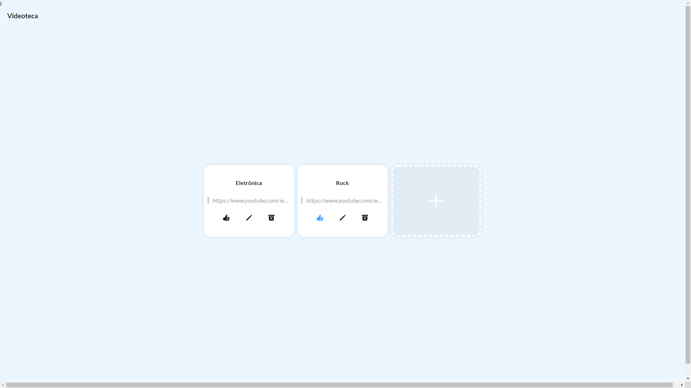
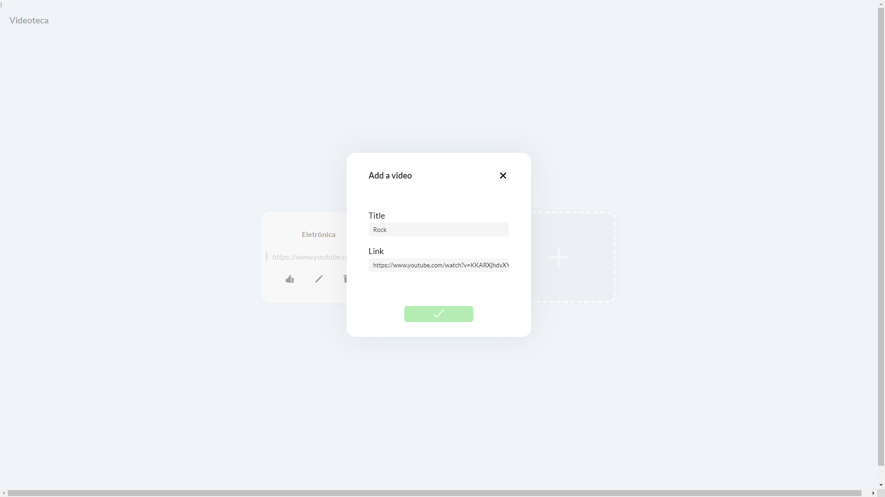
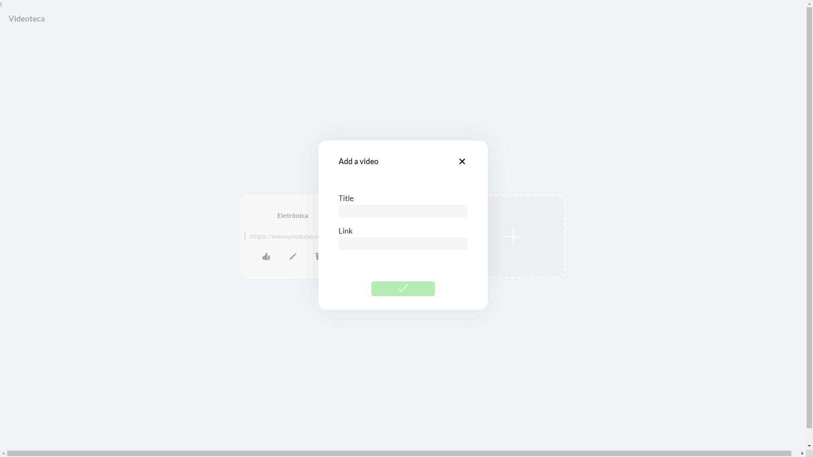

  <h1 align="center">Sobre o Projeto</h1>
  
É uma aplicação web, na qual utilizei na parte do back-end o Node.js e no front-end React.js. Com o Node.js utilizei o framework express para a criação de uma Api Rest, criando rotas para pegar os dados, postar dados, entre outras. Para verificar a Api sem ter o front-end pronto, usei o Insomnia e como banco de dados utilizei o Mongodb. Na parte do front-end utilizei Hooks do React e criei um, com a biblioteca axios, para facilitar o consumo da Api. Separei o projeto em diversos componentes para facilitar o gerenciamento dele, além de usar a biblioteca styled-componentes para estilizá-los de forma individual e poder utilizar ferramentas que não estão presentes no CSS. Para melhorar a experiência do usuário usei a biblioteca SWR, junto com o conceito de UI otimista. No projeto concluído é possível adicionar link de vídeos, com títulos, podendo editar ambos, como também excluí-los. Além de ser possível dar like, fazendo com que o svg do like mude de cor para azul

  

  <h1 align="center">Layout do Site</h1>
    
    
   

  <h1 align="center">Tecnologias utilizadas</h1>
  <ul>
    <li>JavaScript</li>  
    <li>React.js</li> 
    <ul>
    <li>Axios</li>
    <li>Hooks</li>
    <li>React Icons</li>
    <li>Styled Components</li>
    </ul>
    <li>Node.js</li>  
    <ul>
    <li>Express</li>
    <li>Mongoose</li>
    <li>uui</li>
    <li>cors</li>
    </ul>
    <li>HTML</li>
    <li>CSS</li>
  </ul>

 <h1 align="center">Autor</h1>
 <h3>Miguel Vianna Feiteira</h3>
 
Email: miguelviannafeiteira@gmail.com

 
Linkedin: https://www.linkedin.com/in/miguel-vianna-59950a219/

